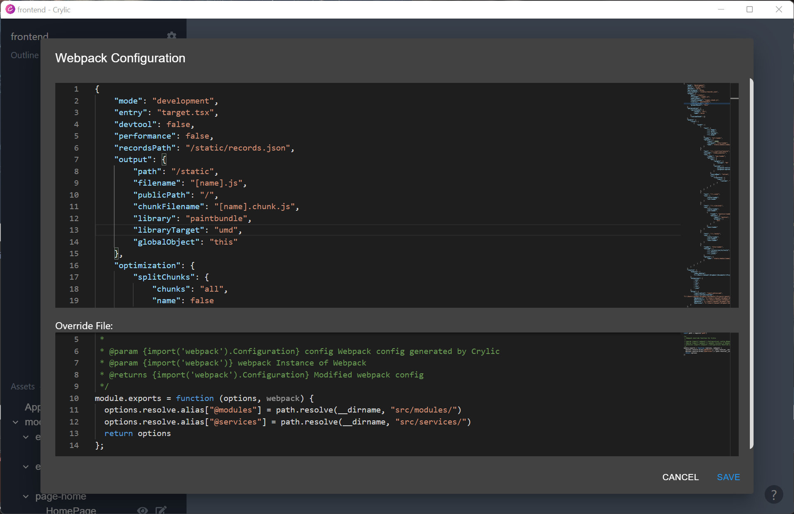

# Component Library

A popular pattern in web development is to have a set of well-defined components that can be used throughout the website. Crylic is well suited to creating, editing, and styling such components.


Crylic is currently limited to basic style and component editing. Additional capabilities, such as creating variants and supporting more frameworks, will be added over time. Let us know what features you'd like to see at [info@crylic.io](mailto:info@crylic.io) or within the in-app feedback form!


This guide will go over how to create a components library utilizing Crylic's `styled-components` integration.

### Adding new components

After opening a project, a button to create new components will be available next to the assets pane.

.png>)

Click this button to open a dialog box that can configure the new component. There are multiple presets available, which can all be used for a component library, as this guide focuses on `styled-components` use `Basic with Styled Component`.

.png>)

The new component is now available. This component can be styled (covered in the [Editing components section](component-library.md#editing-components)) and added to other components (covered in the [Composing components section](component-library.md#composing-components)).

### Editing components

To edit components, they need to be rendered onto the main workspace using the render button within the assets pane. New components are automatically added to the main workspace when they are created.

.png>)

After adding the component to the workspace, it can be edited. The outline pane displays all the elements of the component that are currently visible. These elements can be selected by clicking on the outline pane or with the `Select Element` tool. A new `styled-component` has a `Container` element by default.


For this guide, element refers to a part of a component. An element can be a different component.


.png>)

After selecting an element, a right pane is shown with editors that can change the style of the selected element. Try changing the height or fill!

Additional elements can be added to the component through the `Add Element` tool.

.png>)

Crylic supports multiple component libraries out of the box. To continue with `styled-components`, select the Styled Components library. Then, use any of the provided components to build on the new component. Try adding a heading!

New elements can be added by clicking on an existing element within the workspace or the outline pane.

 (1).png>)

Elements can also be reordered by dragging them in the outline pane.

Finally, elements can also be deleted with the `Delete` key or the Delete Element button within the element editor.

.png>)

### Composing components

Crylic supports composing components together within the editor, utilizing the add element button within the assets pane.

.png>)

This button works the same as the add element tool but allows you to compose your own components easily!

 (1).png>)


Does that button look familiar? It's because the project open in the screenshot is Crylic's own component library! Crylic is able to contribute to itself 🚀

